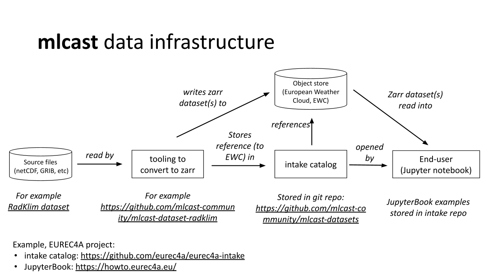

# MLCast Community intake catalog

Hi! 👋

You are looking at the source data intake catalog for the MLCast community. This is a collection of datasets we have currated with the aim of making them available to build machine learning training datasets from.

The following diagram shows the intended data flow and how the intake catalog (this repository) fits into the overall architecture of the MLCast project.


[source for this graphic](https://docs.google.com/presentation/d/1hIlPOer4T9hlxp0mnQ8WQRggSzVUqMID/edit?slide=id.p1#slide=id.p1)


## How to use this catalog

To use the catalog, you need to have the following packages installed:

```bash
pip install intake intake-xarray zarr jinja2
```

*Or*, you can installing the mlcast-datasets package directly from this
repository, which will install all the necessary dependencies:
   
   ```bash
   pip install git+https://github.com/mlcast-community/mlcast-datasets
   ```
   
The catalogue (and underlying data) can then be accessed directly from python:

```python
>> from intake import open_catalog
>> cat = intake.open_catalog("https://raw.githubusercontent.com/mlcast-community/mlcast-datasets/main/catalog.yml")
```

You can list the available sources with:

```python
>> list(cat)
['precipitation']

>> list(cat.precipitation)
['radklim']
```

Then load up a [dask](https://github.com/dask/dask)-backed `xarray.Dataset` so
that you have access to all the available variables and attributes in the
dataset:
   

```python
>> ds = cat.precipitation.radklim_hourly.to_dask()
>> ds

   <xarray.Dataset> Size: 798GB
Dimensions:  (time: 201600, y: 1100, x: 900)
Coordinates:
    lat      (y, x) float64 8MB dask.array<chunksize=(1100, 900), meta=np.ndarray>
    lon      (y, x) float64 8MB dask.array<chunksize=(1100, 900), meta=np.ndarray>
  * time     (time) datetime64[ns] 2MB 2001-01-01T00:50:00 ... 2023-12-31T23:...
  * x        (x) float64 7kB -4.43e+05 -4.42e+05 -4.41e+05 ... 4.55e+05 4.56e+05
  * y        (y) float64 9kB -4.758e+06 -4.757e+06 ... -3.66e+06 -3.659e+06
Data variables:
    RR       (time, y, x) float32 798GB dask.array<chunksize=(1, 1100, 900), meta=np.ndarray>
    crs      (time) float64 2MB dask.array<chunksize=(1,), meta=np.ndarray>
    ...
```
   
Start using the dataset 🙂


## Contributing

We are always looking for new datasets to add to the catalog. If you have a dataset you would like to contribute, please open an issue or a pull request.